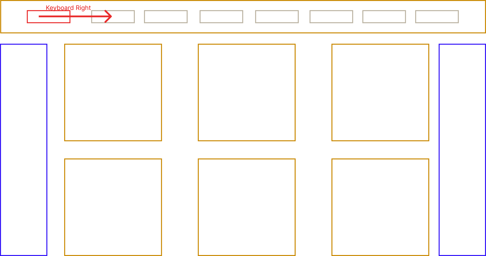
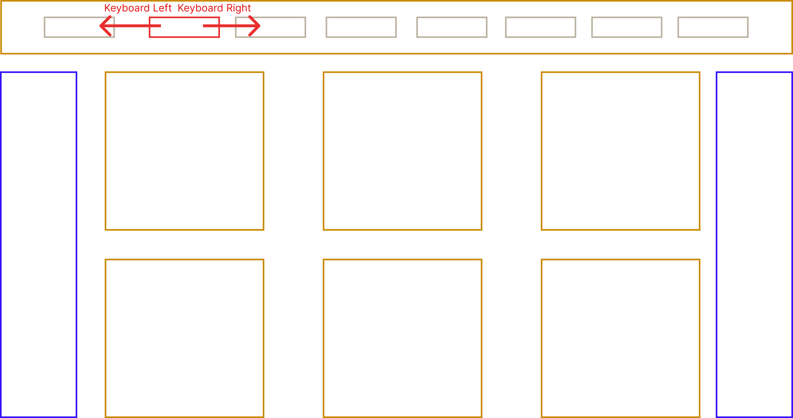
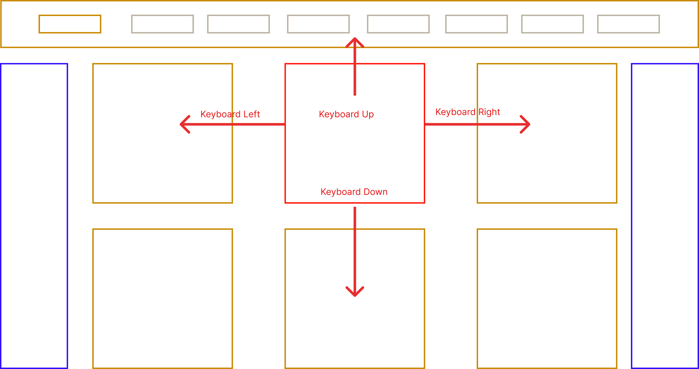
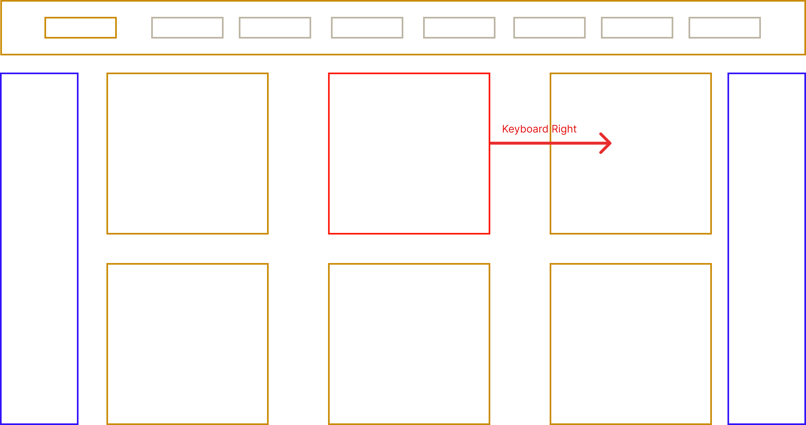
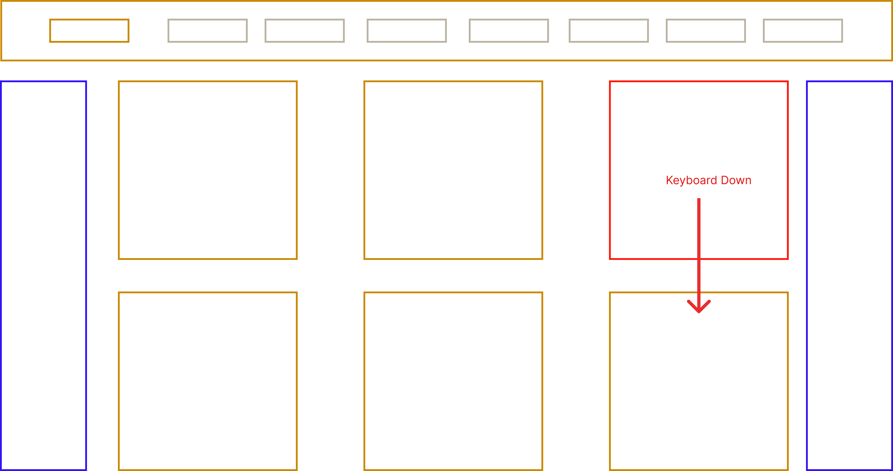
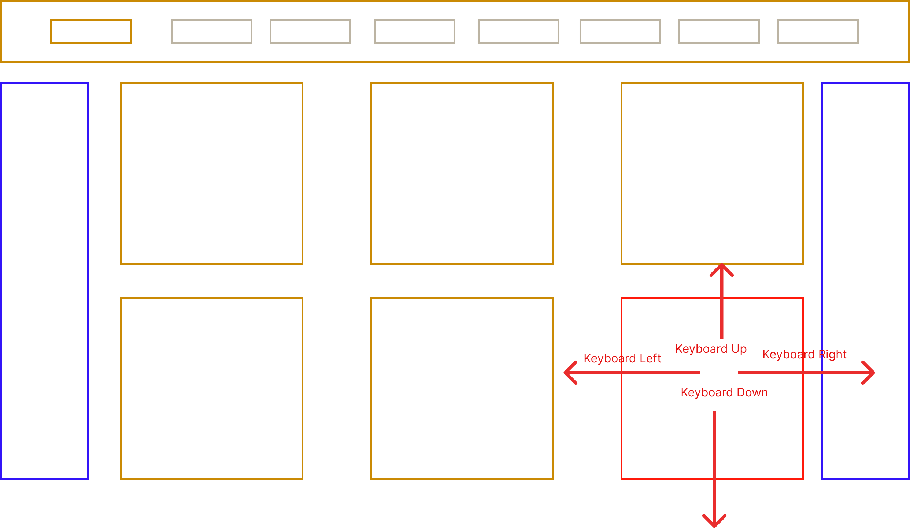

# SPAN-SPLASH

A `keyboard-first` image viewing interface which pulls images from [Unsplash.com](https://unsplash.com/).

## Setup

`npm i`

Create a `.env` file containing a `VITE_UNSPLASH_ACCESS_KEY={UNSPLASH_API_KEY_HERE}`

## Running

`npm run dev`

## Architecture

- [TypeScript](https://www.typescriptlang.org/) Types... no vanilla here
- [Vite](https://vitejs.dev/) Vite transpilation is done on-demand (Making it faster than CRA)
- [React.js](https://reactjs.org/)
- [TailwindCSS](https://tailwindcss.com/)

## Keyboard Navigation

As mentioned, `SPAN-SPLASH` was built keyboard first.

This means anything from the `Navigation Bar` to the `Grid content area` is accessible viable keyboard control.

For the Nav bar (Which gets focused if `Up arrow` key is pressed if the grid is currently on the first Row):

With a Right

Image below shows area of movement accessed via the `arrow` keys.

I.e. Right Arrow key press:

Results in:

With a further `Down arrow` key press resulting in:

